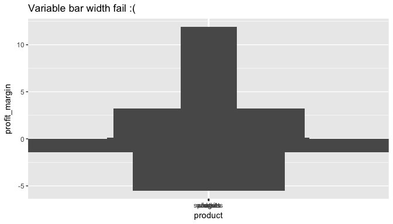
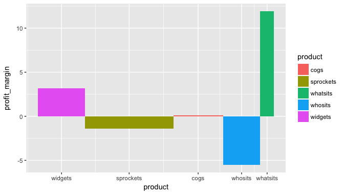
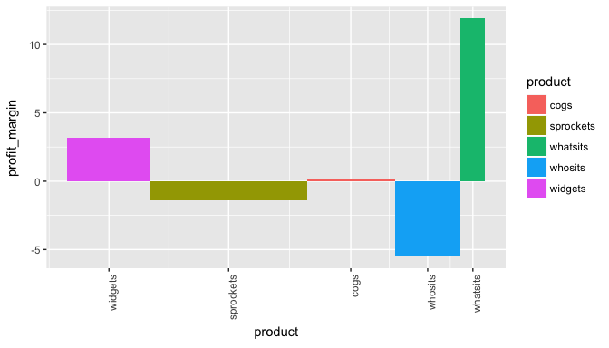

# Introduction to the mekko package

### Bar mekko graphics in R

This is a quick introduction to the bar mekko function* in
the mekko package.

Its main value is to add quantitative context to a bar graph, via bar width.


<br>
Install with:

```r
install.packages("mekko")
```

You can also install the development version with `devtools::install_github('ryninho/mekko', build_vignettes = TRUE)`.

View examples with:

```r
vignette("mekko-vignette")
```


```r
library(ggplot2)
library(mekko)
```


```r
profits <- data.frame(
  product = c('widgets', 'sprockets', 'cogs', 'whosits', 'whatsits'),
  profit_margin = c(3.2, -1.4, 0.1, -5.5, 11.9),
  revenue = c(850, 1600, 900, 675, 250)
  )
```

### Bar mekko

Let's take a look at profit margin by product using ggplot2.


```r
ggplot(profits, aes(x = product, y = profit_margin)) +
  geom_bar(stat = "identity")
```

<!-- -->

Well that's insightful, but I don't know how worried I should be about the
margin on whosits or cogs, nor do I know how happy I should be about whatsits
knocking it out of the park. Maybe I can add revenue as the bar width so I know
what's important here?


```r
ggplot(profits, aes(x = product, y = profit_margin, width = revenue)) +
  geom_bar(stat = "identity") +
  labs(title = "Variable bar width fail :(")
```

```
## Warning: position_stack requires non-overlapping x intervals

## Warning: position_stack requires non-overlapping x intervals
```

<!-- -->

Well shucks, that looks like some kind of Atari game airplane. Let's use the
mekko package to put our margins in context.


```r
bmx <- barmekko(profits, product, profit_margin, revenue)
bmx
```

<!-- -->

Alright, so actually the weak margins on sprockets are worth as much focus as
the problem with whosits. Also, no high-fives for margins on the whatsits until
we triple sales of them.

Those labels are a little close together- this is a ggplot object so let's use
the usual method of rotating the axes.


```r
bmx + theme(axis.text.x = element_text(angle = 90, hjust = 1))
```

<!-- -->

### Appendix

* This package originally included a marimekko function as well, but the latter was discovered to be well covered in [other](https://CRAN.R-project.org/package=ggmosaic/vignettes/ggmosaic.html) [packages](https://www.semanticscholar.org/paper/Product-Plots-Wickham-Hofmann/0598a59354cb96161d68dab91fb0de21fb8671fd/figure/6), so it was removed to simplify maintenance.
